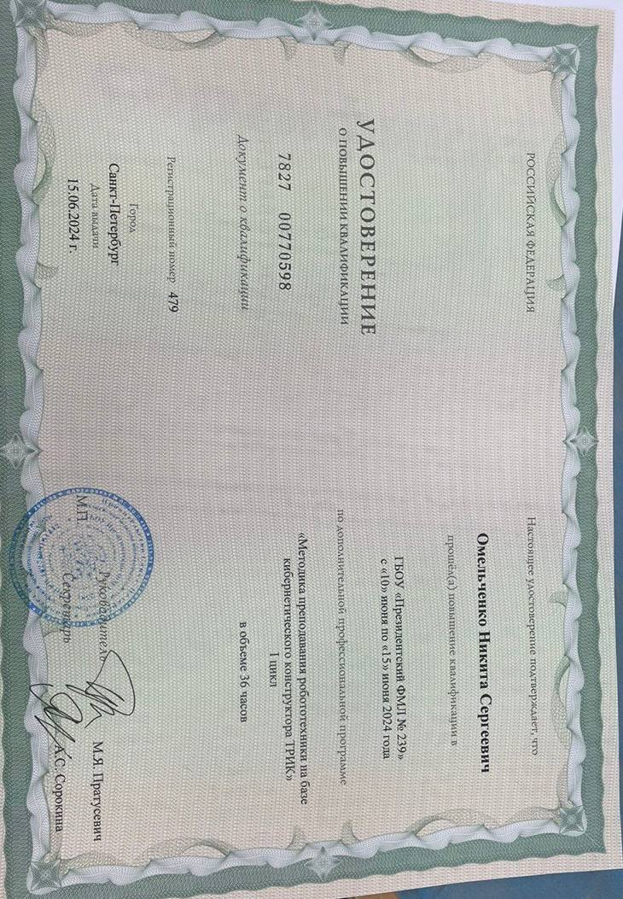
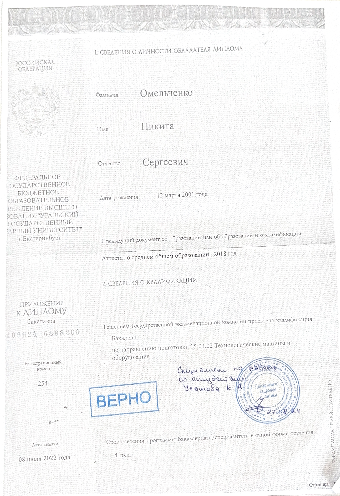
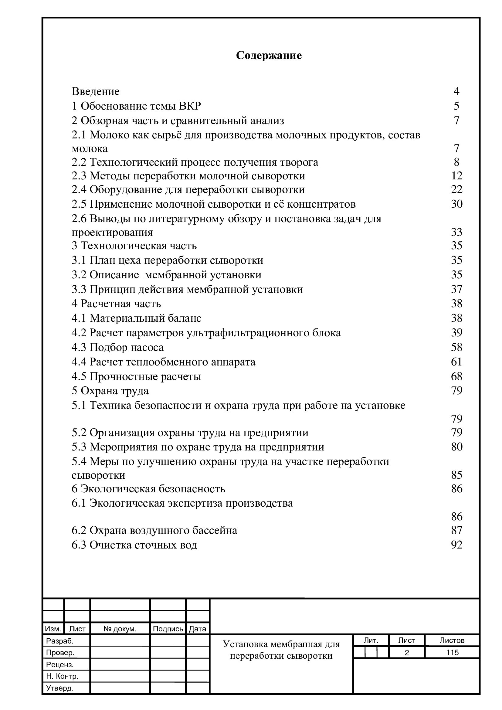

# Омельченко НИкита Сергеевич  
**Инженер | Преподаватель робототехники и программирования**  
📍 Екатеринбург | 📧 olix1203@vk.com | 📞 (+7 (912) 69 54 217) | Telegram (@olixnip)

---

## 🔍 Обо мне  
Инженер с педагогическим опытом, увлечённый робототехникой и автоматизацией. Умею объяснять сложные концепции простым языком. Ищу возможность применить технические навыки в инженерных проектах.  

---

## 🛠 Навыки  
### Технические  
- Программирование: **Python**, **C++** (база), **Scratch**  
- Платформы: **Arduino**, **Lego Mindstorms**  
- 3D-моделирование:  **TinkerCAD** , **SketchUp**
- Электроника: пайка, работа с датчиками, сборка схем  
- Инструменты: 3D-принтеры, лазерные гравёры  

### Педагогические  
- Разработка учебных программ  
- Подготовка к соревнованиям (Робофест, RRO)  
- Управление проектной деятельностью учеников  

---

## 💼 Опыт работы  
**Семейный досуговый центр "ИНТЕЛЛЕКТ", Екатеринбург**  
*Преподаватель робототехники* | 2020 – н.в.  
- Обучение детей 8–16 лет: программирование, 3D-печать, создание роботов.  
- 15+ учеников — призёры региональных конкурсов.   

---

## 🎓 Образование  
**Уральский ГАУ (УрГАУ)**  
*Инженерный факультет, направление "ТМО"* | 2018–2022  

**Содержание ВКР**

---

## 📂 Проекты  
1. **[Умная теплица]**  
   - Автоматический полив на Arduino + датчики влажности.    

2. **[Робот-сортировщик]**  
   - Lego Mindstorms EV3 + Python, сортировка объектов по цвету.  

---
